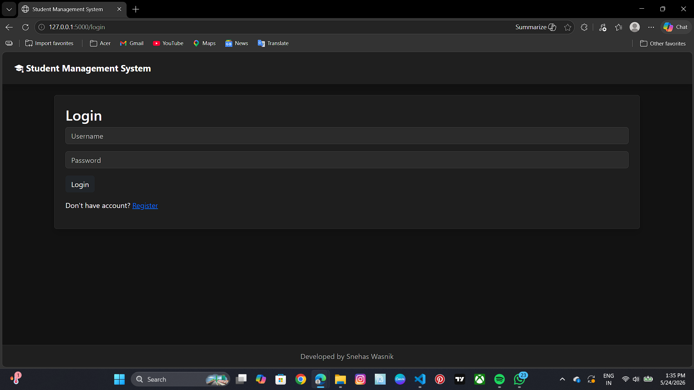
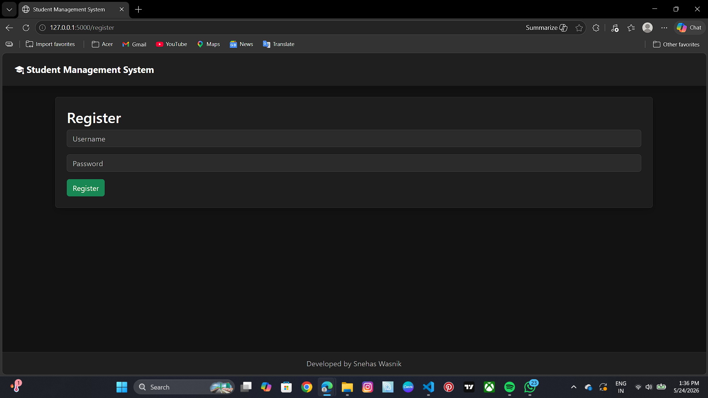
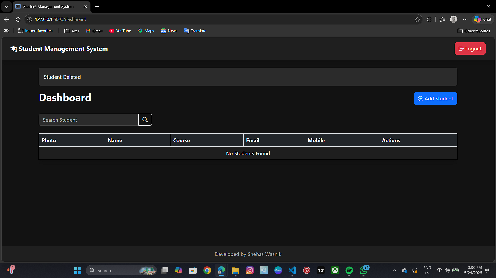
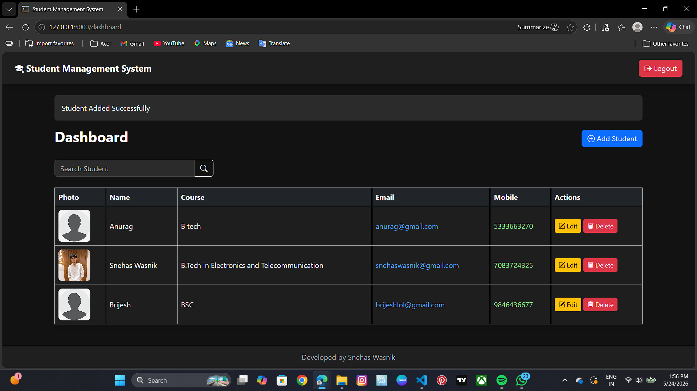
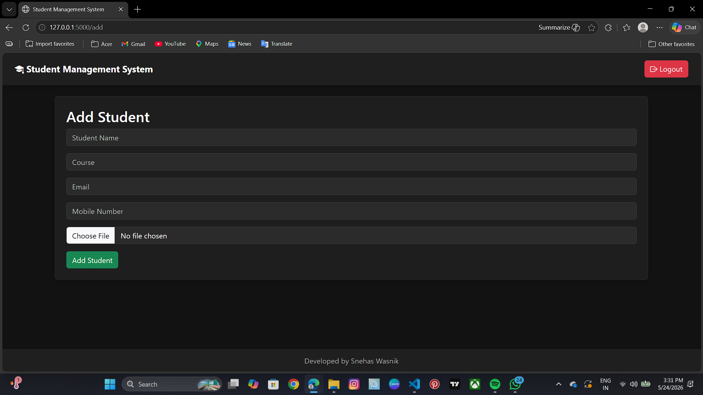

# Student Management System

A modern Flask-based Student Management System with authentication, CRUD operations, search functionality, image upload support, and dark mode UI.

---

## Features

- User Authentication (Login/Register)
- Add, Edit, Delete Students
- Search Students
- Student Photo Upload
- Default Profile Image
- Mobile Number Support
- Email & Phone Clickable Links
- Dark Mode Dashboard
- Responsive UI
- Logout & Delete Confirmation
- SQLite Database Integration

---

## Tech Stack

- Python
- Flask
- SQLAlchemy
- SQLite
- HTML5
- CSS3
- Bootstrap 5

---

## Installation

### Clone Repository

```bash
git clone https://github.com/Snehasss03/student-management-system.git
```

### Move Into Folder

```bash
cd student-management-system
```

### Create Virtual Environment

```bash
python -m venv venv
```

### Activate Virtual Environment

#### Windows

```bash
venv\Scripts\activate
```

### Install Dependencies

```bash
pip install -r requirements.txt
```

### Run Flask App

```bash
python app.py
```

---

## Project Screenshots

## Project Screenshots

### Login Page



---

### Register Page



---

### Dashboard1



---

### Dashboard2



---

### Add Student Page



---

## Author

Snehas Wasnik